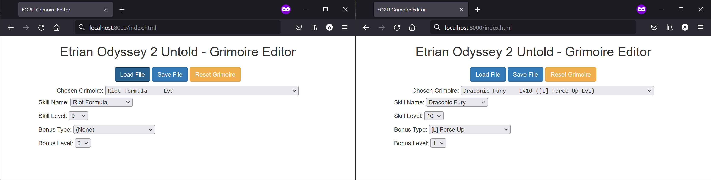

# Etrian Odyssey 2 Untold Grimoire Editor

## Running
### Windows
Run the `eo2u_grimoire_editor.exe` file from the `dist/` folder. Make sure that the `skill_data/` folder is in the same directory as the executable file, otherwise it will not run.

### Mac/Linux
Requirements:
- Python 3
- Basic command line usage

Download the code from this repository navigate to the directory and using the terminal. From there, run the commands below
```
pip install -r requirements.txt
python eo2u_grimoire_editor.py
```

The first command installs the packages necessary to run the program. The second one runs the program.

## How to Use (with pictures!)

Obtain a backup of a save file for the game using `Checkpoint` or a similar tool for the 3DS. The file of interest should be called `mo2r00_game.sav`. I strongly suggest backing up this save file in case things go wrong.

Launch the grimoire editor program and load the save file using the `Load File` button. You should see a screen similar to the one below on the left. I am going to change Level 9 Riot Formula to Level 10 Dragonic Fury by selecting the skill and level from the corresponding dropdown menus. Similarly, I'm going to set the grimoire bonus to the legendary effect Force Up. Note that once you edit the grimoire, the label in the dropdown menu is going to change.

<div align="center">

</div>

You can select and edit other grimoires by selecting them from the `Chosen Grimoire` dropdown at the top of the page. If you would like to reset a grimoire to its original state, click the `Reset Grimoire` button. Note that this only changes the actively selected grimoire. Once you have made your edits, click `Save File` and choose where to write the updated save file. Upon loading the save file, you should see your edited grimoire(s).

<div align="center">

</div>


## Build/Debug

Requirements:
- Python 3
- The packages from `requirements.txt`

To run the program locally, please follow the instructions to run on a Mac/Linux computer.

To build the `.exe` file locally, install [pyinstaller](https://pyinstaller.org/en/stable/) and run the following command
```
python -m eel eo2u_grimoire_editor.py web --onefile
```
This will generate an executable file in the `dist/` directory (`eo2u_grimoire_editor.exe`). Make sure that the `skill_data/` folder is in the same directory as the executable file, otherwise it will not run.
